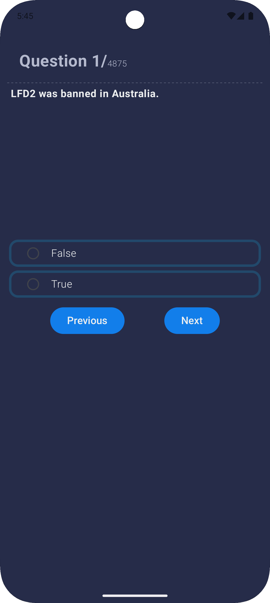
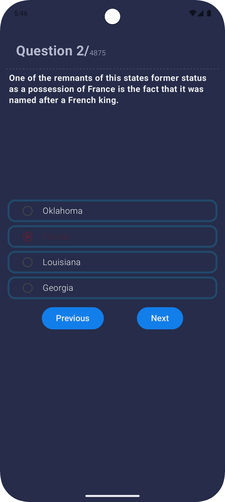
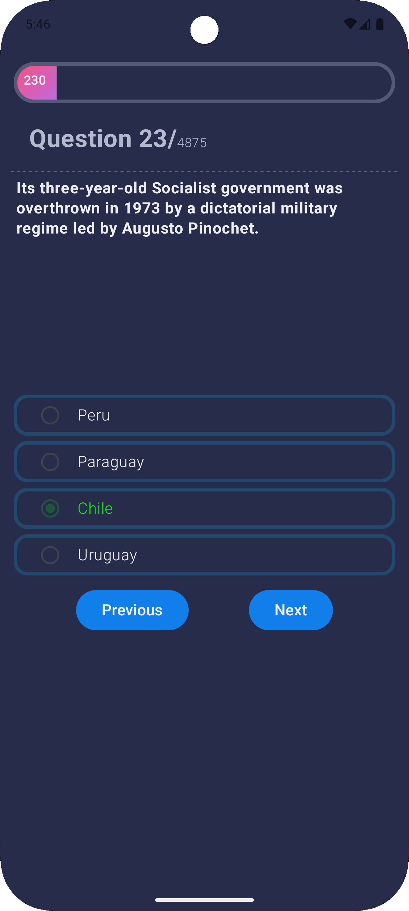

# 🧠 QuickQuiz - Trivia App  

QuickQuiz is an interactive trivia application designed using **Kotlin** and **Jetpack Compose**. It allows users to answer multiple-choice questions, track their progress, and enhance their knowledge in a fun and engaging way. This app demonstrates modern **Android development** practices using **MVVM architecture**, **Retrofit for API calls**, and **Hilt for dependency injection**.

---

## 🚀 Features  

- **Real-Time Data Fetching**: Fetches quiz questions dynamically using **Retrofit**.  
- **Interactive UI**: Built entirely using **Jetpack Compose**, ensuring a fluid and modern UI experience.  
- **Answer Validation**: Highlights selected answers in **green** (correct) or **red** (incorrect).  
- **Navigation Controls**: Users can move to the **Next** or **Previous** question seamlessly.  
- **Loading Indicator**: Displays a **CircularProgressIndicator** while fetching questions.  
- **Progress Tracking**: Displays the current question count and a **progress bar** to track quiz completion.  

---

## 📸 Screenshots  

### **Loading Screen**  


### **First Question**  


### **Correct Answer Selected**  


### **Wrong Answer Selected**  


### **Progress Bar with Score**  


---

## 🛠️ Tech Stack  

- **Language**: Kotlin  
- **UI Framework**: Jetpack Compose  
- **Networking**: Retrofit  
- **Dependency Injection**: Hilt  
- **State Management**: MutableState & ViewModel  
- **Material Design 3**: Modern UI components and theming  

---

## 📂 Folder Structure  

```plaintext
com.example.quickquiz
├── component           # Jetpack Compose UI components
├── data                # Data models and state wrappers
├── di                  # Hilt Dependency Injection setup
├── model               # Question and related data classes
├── network             # Retrofit API setup for fetching questions
├── repository          # Repository handling data operations
├── screens             # Composable screens and ViewModel
├── ui.theme            # Custom themes and colors
├── util                # Utility classes such as AppColors and Constants
└── MainActivity.kt     # Entry point for the app
```

## Clone the Repository
To get a local copy of the project up and running, clone the repository:
```bash
git clone https://github.com/MohammedYusuf-123/QuickQuiz.git
cd quickquiz
```

---

## Contributions are welcome! Follow these steps to contribute:
	1.	Fork the Repository: Click the “Fork” button on GitHub.
	2.	Create a Branch: Create a new branch for your feature:
			git checkout -b feature/your-feature
	3.	Commit your changes and push to your fork:
			git commit -m "Add your message here"
			git push origin feature/your-feature
	
